<div align="center">


</div>

<div align="center">

### `$ whoami --verbose`


</div>

<div align="center">


</div>

<div align="center">

[](https://www.linkedin.com/in/kaushik-mishra-5827a832a/)
[](mailto:mishrakaushik795@gmail.com)
[](https://github.com/kaushik945)
[](https://www.instagram.com/kaushikmishra16/)

</div>

<div align="center">


</div>

<br>

### `$ cat about.md`

I'm a second-year CSE undergrad at NIT Raipur who builds practical, end-to-end AI-powered applications rather than just notebooks. I split my time between machine learning, full-stack development, and competitive programming — currently chasing depth in all three at once. I like shipping things people can actually click on.

```bash
ROLE      : Aspiring Software Engineer (AI/ML & Full-Stack)
EXP       : 0 years professional | 2nd Year B.Tech
DOMAIN    : Artificial Intelligence, Machine Learning, Full-Stack Web Dev, Competitive Programming
STACK     : C++, Python, Java, JavaScript, React, FastAPI, PyTorch, TensorFlow
OPEN_TO   : SWE Intern | AI/ML Intern | Full-Stack Intern | Backend Intern
```

<br>

### `$ ls tech-stack/`

**Languages**


**Frameworks & ML Libraries**


**Tools**


<br>

### `$ grep -r "specialty" ./skills`

<div align="center">


</div>

<br>

### `$ column -t expertise.tsv`

<div align="center">

| Domain | Proficiency | Details |
|---|---|---|
| Machine Learning | ★★★★☆ | Scikit-learn, TensorFlow, PyTorch — model building, explainability, feature engineering |
| Full-Stack Development | ★★★★☆ | React, FastAPI, Streamlit, Tailwind CSS — end-to-end app delivery |
| Competitive Programming | ★★★☆☆ | Active on LeetCode, Codeforces, CodeChef |
| Data Structures & Algorithms | ★★★★☆ | Core C++ / Java problem solving, currently deepening advanced DSA |
| Computer Vision | ★★★☆☆ | ML Team, Robotix Club — CV & AI/ML project contributions |
| Deployment & Tooling | ★★★☆☆ | Git, GitHub, VS Code, LaTeX, Figma, Blender |

</div>

<br>

### `$ ./run --featured-projects`

<details open>
<summary><b>💳 Credit Health Score</b></summary>
<br>

An end-to-end ML-powered credit risk prediction system covering feature engineering, model explainability, and deployment.

| | |
|---|---|
| **Stack** | Python, Scikit-learn, FastAPI, Streamlit |
| **Scale** | Full pipeline — data → model → explainability → deployed app |
| **Impact** | Demonstrates production-style ML workflow, not just a notebook model |

🔗 [github.com/kaushik945/credit-health](https://github.com/kaushik945/credit-health)

</details>

<details>
<summary><b>📄 AI Resume Builder</b></summary>
<br>

An AI-assisted resume builder that generates professional LaTeX resumes through a modern, responsive interface.

| | |
|---|---|
| **Stack** | HTML, CSS, JavaScript, Tailwind CSS |
| **Scale** | Client-side generator with LaTeX resume output |
| **Impact** | Simplifies professional resume creation with a clean, responsive UI |

</details>

<br>

### `$ tail -f experience.log`

**Executive — Robotix Club (ML Team), NIT Raipur** `Present`

- Contributing to AI/ML and computer vision projects
- Collaborating on technical projects and workshops
- Developing practical ML solutions with fellow club members

`#MachineLearning` `#ComputerVision` `#Teamwork`

<br>

### `$ cat achievements.md`

<div align="center">

| Achievement | Detail |
|:---:|:---:|
| 🎓 CGPA | 8.10 / 10 at NIT Raipur |
| 🤖 Project | Built & deployed Credit Health Score — full ML pipeline |
| 💻 Project | Built AI Resume Builder with LaTeX generation |
| 🏆 Competitive Programming | Active across LeetCode, Codeforces & CodeChef |

</div>

<br>

### `$ ./show --education`

<div align="center">


</div>

<br>

### `$ curl coding-profiles/`

<div align="center">

[](https://leetcode.com/u/0xK4u5h1k/)
[](https://codeforces.com/profile/kaushikmishra_)
[](https://www.codechef.com/users/oxk4u5h1k)

</div>

<br>

### `$ ./generate --github-analytics`

<div align="center">






</div>

<br>

### `$ ./plot --activity-graph`

<div align="center">


</div>

<br>

### `$ ./summary --full`

<div align="center">


</div>

<br>

### `$ ./play --snake`

<div align="center">


</div>

<br>

### `$ cat current-focus.yaml`

```yaml
learning:
  - Advanced Data Structures & Algorithms
  - Machine Learning & Deep Learning
  - React

building:
  - AI-powered Full-Stack Applications
  - Credit Health Score (ML pipeline)
  - AI Resume Builder

exploring:
  - Competitive Programming (LeetCode, Codeforces, CodeChef)
  - Computer Vision @ Robotix Club, NIT Raipur

open_to:
  - Software Engineering Intern
  - AI/ML Intern
  - Full-Stack Developer Intern
  - Backend Developer Intern
```

<br>

### `$ ./connect --all`

<div align="center">

[](https://www.linkedin.com/in/kaushik-mishra-5827a832a/)
[](https://www.instagram.com/kaushikmishra16/)
[](mailto:mishrakaushik795@gmail.com)
[](https://github.com/kaushik945)

</div>

<div align="center">

*"Ship end-to-end, learn in public, iterate fast."*

</div>


